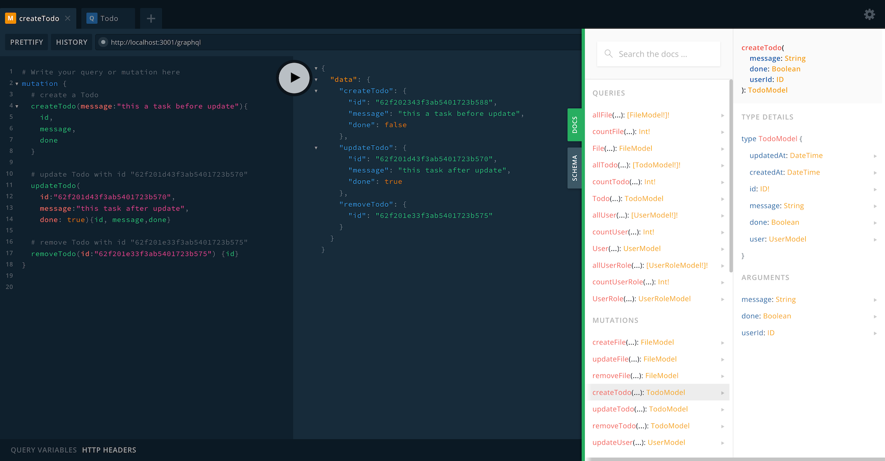
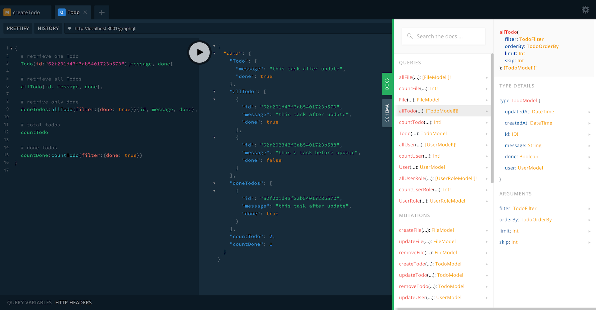
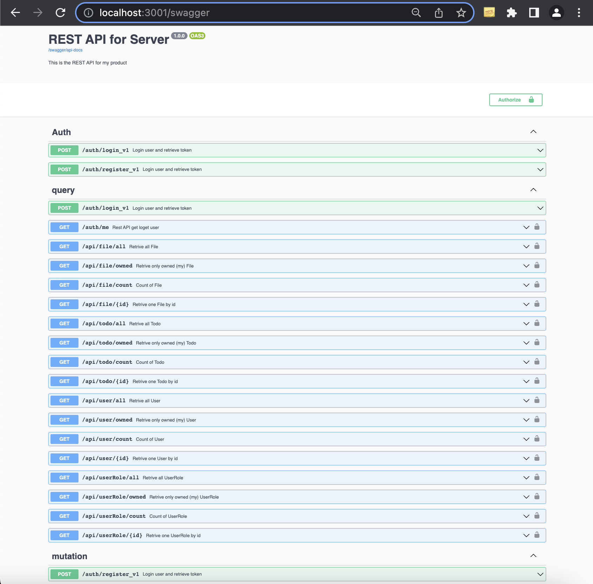

# GraphQL Monster Builder

Build server with CRUD with GraphQL and Rest API interface. With these features:

-   Generate server base on simple [schema file](https://github.com/miuan/graphql-monster-builder/blob/master/Schema.md)
-   Integrated authentication to secure models with [pre-defined rules](https://github.com/miuan/graphql-monster-builder/blob/master/Schema.md#model-permissions)
-   [Hooks](https://github.com/miuan/graphql-monster-builder/blob/master/Readme.md#hooks) to customize the server to your needs without breaking (re)build process
-   Integrated GraphQL documentation and Swagger for Rest API
-   Prepared [CRA templates](https://github.com/graphql-monster/cra-template-graphql-monster) for easy connect to React App (ES6 or [Typescipt](https://github.com/miuan/cra-template-graphql-monster-typescript))

# Usage

```
$ graphql-monster-builder <operation> <schema> <outdir>
```

## Example

Example of simple todo server. Create [Schema File](https://github.com/miuan/graphql-monster-builder/blob/master/Schema.md) file with name `todo.schema` and folowing content in your local directory.

_Note: Be sure on your system is running instance of [MongoDB](https://www.mongodb.com/)_

```graphql
@all(filter:"user_every.id={{userId}}")
@create("public") @one("public") @update("public") @remove("public")
type Todo @model {
  message: String
  done: Boolean @default(false)
}
```

Then run these command to actual create graphql-monster-server to directory with name `todo-server`

```
npx graphql-monster-builder --backend todo.schema todo-server

# or

npm i -g graphql-monster-builder
graphql-monster-builder --backend todo.schema todo-server
```

Now you should just move to `todo-server` directory and run generated server

```
cd todo-server/ && yarn && yarn start
```

Now you can check the:

-   GraphQL Playground -> [http://localhost:3001/grapqhl](http://localhost:3001/graphql)
-   Swagger -> [http://localhost:3001/swagger](http://localhost:3001/swagger)

## GraphQL

Here is some examples with GraphQL mutations over `Todo` model

Here is some examples with GraphQL mutations over `Todo` model


# Rest API

The same can be acomplish with Rest API what is documented by Swagger


# Documentation

For more about schema definition, please visit our documentation:

-   [Schema Description](https://github.com/miuan/graphql-monster-builder/blob/master/Schema.md) - How create a GraphQL Monster model.
-   [Model Relations](https://github.com/miuan/graphql-monster-builder/blob/master/Schema.md#relations) - Managing model relations.
-   [Model Permissions](https://github.com/miuan/graphql-monster-builder/blob/master/Schema.md#model-permissions) – How secure particular CRUD operation of invidual model.
-   [Obtain Token (Login)](https://github.com/miuan/graphql-monster-builder/blob/master/Login.md) – How login, register user and retrieve token to access protected models.

[](https://www.youtube.com/watch?v=SE2313FeboY)

_You can check video how to create models on www.graphql.monster platform_

# Hooks

During project development You will probably very often updating the schema (adding new models or updating existing or maybe changing the protecting rules). To customize server functionality is a option of adding a hook. Hooks can be of this two type:

-   before
-   after

and can have handle these actions:

-   One (read one item)
-   All (read all items)
-   My (read all my items)
-   Create (create one item)
-   Update (update one item)
-   Delete (delete one item)

Hooks are setlet in file `entryHooks.ts` in `services/` with export object `hooks` with your defined overrides

```javascript
// example of `service/entryHooks.ts`

export const hooks = {
    services: {
        beforeTodoCreate: async (entry, todo) => {
            // do some action before Todo is stored into DB
            todo.data.message = `Created Todo: ${todo.data.message}`
            return todo.data
        },
        beforeTodoUpdate: async (entry, todo) => {
            // do some action before Todo is updated in DB
            todo.data.message = `Updated Todo: ${todo.data.message}`
            return todo.data
        },
        afterTodoCreate: async (entry, todo) => {
            // do some action after Todo is updated in DB
            return todo.data
        },
        afterTodoCreate: async (entry, todo) => {
            // do some action after Todo is updated in DB
            return todo.data
        },
    },
}
```

_Note: what is in `gen/` is have fully on control the builder generator, so what ever you will change will be in next (re)build lost!_

# Contain

-   [NodeJS](https://nodejs.org/en/)
-   [Apollo](https://www.apollographql.com)
-   [koa](https://koajs.com/)
-   [MongoDB](https://www.mongodb.com/)
-   [Swagger](https://swagger.io/)
-   [Jest](https://jestjs.io/)
